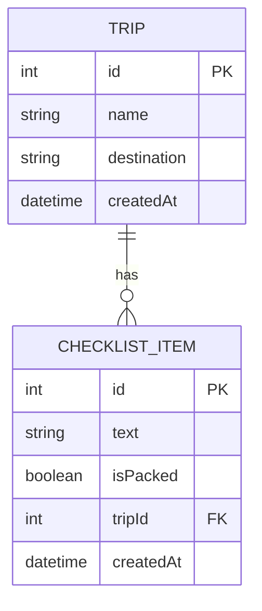

# Travel Checklist Backend Plan

## Database relationship

One trip can have many checklist items. Each checklist item belongs to one trip.



## Trip

| Field | Type | Purpose |
| --- | --- | --- |
| `id` | Integer | Unique number for the trip |
| `name` | String | Name of the trip |
| `destination` | String | Where the user is travelling |
| `createdAt` | Date and time | When the trip was created |

## ChecklistItem

| Field | Type | Purpose |
| --- | --- | --- |
| `id` | Integer | Unique number for the item |
| `text` | String | What the user needs to pack |
| `isPacked` | Boolean | Whether the checkbox is checked |
| `tripId` | Integer | Connects the item to its trip |
| `createdAt` | Date and time | When the item was created |

## Example

```text
Trip: Summer Holiday
Destination: Spain

Checklist items:
- Passport (not packed)
- Sunglasses (packed)
- Toothbrush (not packed)
```

## API plan

All backend addresses begin with `/api`.

| Method | Address | Purpose | Successful status |
| --- | --- | --- | --- |
| `GET` | `/api/trips` | Get all trips | `200 OK` |
| `POST` | `/api/trips` | Create a new trip | `201 Created` |
| `GET` | `/api/trips/:tripId/items` | Get all items for one trip | `200 OK` |
| `POST` | `/api/trips/:tripId/items` | Add an item to one trip | `201 Created` |
| `PATCH` | `/api/items/:id` | Change an item's text or packed status | `200 OK` |
| `DELETE` | `/api/items/:id` | Delete an item | `204 No Content` |

In an address, text beginning with `:` is a value that changes. For example,
`/api/trips/1/items` gets the checklist items belonging to trip `1`.

## Request and response examples

### Create a trip

`POST /api/trips`

Request:

```json
{
  "name": "Summer Holiday",
  "destination": "Spain"
}
```

Response:

```json
{
  "id": 1,
  "name": "Summer Holiday",
  "destination": "Spain",
  "createdAt": "2026-09-21T10:00:00.000Z"
}
```

### Add a checklist item

`POST /api/trips/1/items`

Request:

```json
{
  "text": "Passport"
}
```

Response:

```json
{
  "id": 1,
  "text": "Passport",
  "isPacked": false,
  "tripId": 1,
  "createdAt": "2026-09-21T10:05:00.000Z"
}
```

### Check or uncheck an item

`PATCH /api/items/1`

Request:

```json
{
  "isPacked": true
}
```

Response:

```json
{
  "id": 1,
  "text": "Passport",
  "isPacked": true,
  "tripId": 1,
  "createdAt": "2026-09-21T10:05:00.000Z"
}
```

### Delete an item

`DELETE /api/items/1`

The item is removed and the server returns `204 No Content`, which means the
request succeeded and there is no response body.

## Error responses

| Status | Meaning |
| --- | --- |
| `400 Bad Request` | Information is missing or invalid |
| `404 Not Found` | The trip or item does not exist |
| `500 Internal Server Error` | An unexpected server problem occurred |

Example validation error:

```json
{
  "message": "The item text is required."
}
```
