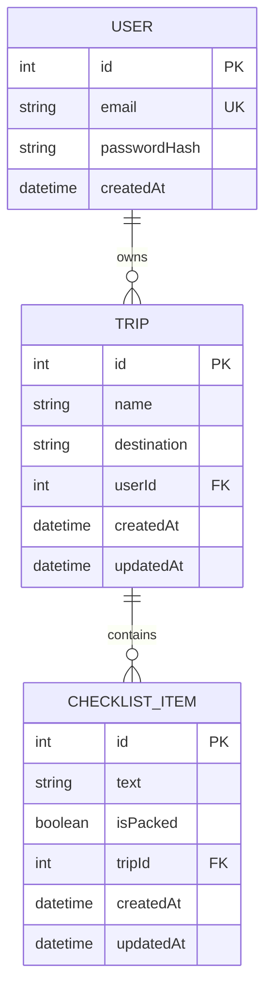

# Travel Checklist Backend Project Plan

## Project purpose

The Travel Checklist API helps travellers organise packing lists for different
trips. A registered user can create trips and manage a private checklist for
each trip. The backend stores the data, validates requests, protects private
routes, and makes the data available through a REST API.

This is an individual project by Dilek. The existing React application is a
client for demonstrating the API, but the assessed project is the backend.

## Problem and intended users

Packing information can become difficult to organise when a person has several
trips. A single unprotected checklist also cannot separate one user's data from
another user's data.

The intended users are travellers who want to:

- create and organise multiple trips;
- keep a separate checklist for every trip;
- mark packing items as complete;
- access only their own trips and checklist items.

## Project scope

### Included

- User registration and login
- Password hashing
- JWT authentication
- Ownership-based authorization
- Trip create, read, update, and delete operations
- Checklist item create, read, update, and delete operations
- Trip search and pagination
- Packed and unpacked item filtering
- Request validation
- Deliberate CORS configuration
- Rate limiting
- Consistent JSON errors
- Automated API tests
- Postman collection
- PostgreSQL persistence
- Backend deployment using HTTPS

### Not included

- MongoDB, because PostgreSQL already fits the relational data model
- Administrator roles, because the core use case only needs normal users
- Social login or OAuth
- Email verification and password-reset emails
- Image and file uploads
- Payments
- Real-time WebSocket features
- Sharing trips between different users

These features are not needed to meet the project requirements and would make
the beginner project unnecessarily large.

## Technology choices

| Technology | Purpose | Reason for choosing it |
| --- | --- | --- |
| Node.js | Backend runtime | It is covered in the module and uses JavaScript on the server |
| Express | REST API framework | It provides clear routing and middleware with a small learning curve |
| PostgreSQL | Persistent database | Users, trips, and items have clear relational connections |
| Prisma | Database access and migrations | It provides a readable schema and safer parameterized queries |
| Zod | Request validation | It validates and trims untrusted request data before controllers use it |
| bcryptjs | Password hashing | It is taught in the course and passwords must never be stored as plain text |
| JSON Web Token | Authentication | A bearer token can protect API routes without a server-side session store |
| express-rate-limit | Abuse protection | It limits repeated requests, especially login attempts |
| Jest and Supertest | Automated API testing | They are taught in the course and can test Express routes automatically |
| Postman | Manual API testing | It makes endpoints and example requests easy to demonstrate |

PostgreSQL will be the only project database. MongoDB is not required because
using two databases would add complexity without solving an additional problem.

## Data model

### Relationship summary

- One user can have many trips.
- Every trip belongs to one user.
- One trip can have many checklist items.
- Every checklist item belongs to one trip.



### User

| Field | Type | Rules |
| --- | --- | --- |
| `id` | Integer | Primary key, automatically generated |
| `email` | String | Required, unique, normalized to lowercase |
| `passwordHash` | String | Required, never returned by the API |
| `createdAt` | Date and time | Automatically generated |

### Trip

| Field | Type | Rules |
| --- | --- | --- |
| `id` | Integer | Primary key, automatically generated |
| `name` | String | Required, maximum 100 characters |
| `destination` | String | Required, maximum 100 characters |
| `userId` | Integer | Foreign key connecting the trip to its owner |
| `createdAt` | Date and time | Automatically generated |
| `updatedAt` | Date and time | Automatically updated |

### ChecklistItem

| Field | Type | Rules |
| --- | --- | --- |
| `id` | Integer | Primary key, automatically generated |
| `text` | String | Required, maximum 200 characters |
| `isPacked` | Boolean | Defaults to `false` |
| `tripId` | Integer | Foreign key connecting the item to a trip |
| `createdAt` | Date and time | Automatically generated |
| `updatedAt` | Date and time | Automatically updated |

Deleting a user deletes that user's trips. Deleting a trip deletes its checklist
items. This prevents checklist items from remaining without a parent trip.

## Authentication and authorization

### Registration

1. The user sends an email and password.
2. Zod validates the request.
3. The email is normalized to lowercase.
4. bcryptjs hashes the password.
5. Only the password hash is stored.

### Login

1. The user sends an email and password.
2. The API finds the user by email.
3. bcryptjs compares the password with the stored hash.
4. The API returns a short-lived JWT when the credentials are correct.

### Protected routes

The client sends the token in this header:

```text
Authorization: Bearer <token>
```

Authentication middleware verifies the token and makes the authenticated user
ID available to protected controllers.

Authorization checks ensure that a user can only read or change trips that have
their own `userId`. Item access is checked through the item's parent trip. The
API should return `404 Not Found` for resources the user does not own so that it
does not reveal whether another user's private resource exists.

Registration, login token creation, JWT verification middleware, and protected
trip ownership are implemented. Standalone item update and delete ownership are
the next authorization stage.

## Planned endpoints

### Public endpoints

| Method | Endpoint | Purpose | Success status |
| --- | --- | --- | --- |
| `GET` | `/api/health` | Check whether the API is running | `200 OK` |
| `POST` | `/api/auth/register` | Create a user account | `201 Created` |
| `POST` | `/api/auth/login` | Authenticate and receive a JWT | `200 OK` |

### Protected trip endpoints

| Method | Endpoint | Purpose | Success status |
| --- | --- | --- | --- |
| `GET` | `/api/trips` | List the authenticated user's trips | `200 OK` |
| `POST` | `/api/trips` | Create a trip for the authenticated user | `201 Created` |
| `GET` | `/api/trips/:id` | Get one owned trip | `200 OK` |
| `PATCH` | `/api/trips/:id` | Update one owned trip | `200 OK` |
| `DELETE` | `/api/trips/:id` | Delete one owned trip and its items | `204 No Content` |

The trip list supports:

- `search` for matching a trip name or destination;
- `page` for selecting the result page;
- `limit` for controlling the page size.

Example:

```text
GET /api/trips?search=berlin&page=1&limit=10
```

### Protected checklist item endpoints

| Method | Endpoint | Purpose | Success status |
| --- | --- | --- | --- |
| `GET` | `/api/trips/:tripId/items` | List items from one owned trip | `200 OK` |
| `POST` | `/api/trips/:tripId/items` | Add an item to one owned trip | `201 Created` |
| `PATCH` | `/api/items/:id` | Edit text or packed status | `200 OK` |
| `DELETE` | `/api/items/:id` | Delete an owned item | `204 No Content` |

The item list supports an optional `isPacked=true` or `isPacked=false` filter.

## Request and response design

### Register request

```json
{
  "email": "traveller@example.com",
  "password": "a-secure-password"
}
```

### Register response

```json
{
  "id": 1,
  "email": "traveller@example.com",
  "createdAt": "2026-10-01T10:00:00.000Z"
}
```

The password and password hash are never included in responses.

### Login response

```json
{
  "data": {
    "token": "<jwt-token>",
    "user": {
      "id": 1,
      "email": "traveller@example.com"
    }
  }
}
```

### Create trip request

```json
{
  "name": "Summer Holiday",
  "destination": "Spain"
}
```

### Paginated trip response

```json
{
  "data": [
    {
      "id": 1,
      "name": "Summer Holiday",
      "destination": "Spain",
      "createdAt": "2026-10-01T10:05:00.000Z",
      "updatedAt": "2026-10-01T10:05:00.000Z"
    }
  ],
  "pagination": {
    "page": 1,
    "limit": 10,
    "total": 1,
    "totalPages": 1
  }
}
```

### Validation error

```json
{
  "message": "Validation failed.",
  "errors": [
    {
      "field": "email",
      "message": "Enter a valid email address."
    }
  ]
}
```

### Authentication error

```json
{
  "message": "Authentication is required."
}
```

### Not-found or unauthorized resource error

```json
{
  "message": "Trip not found."
}
```

## Security plan

- Validate all request bodies, parameters, and query strings with Zod.
- Trim strings and normalize email addresses.
- Use Prisma parameterized queries instead of building SQL strings.
- Hash passwords with bcryptjs before storing them.
- Keep JWT secrets, database URLs, and allowed origins in environment variables.
- Apply authentication middleware to all trip and item routes.
- Check ownership in every protected controller.
- Configure CORS with an explicit client origin.
- Apply stricter rate limits to registration and login.
- Apply a general rate limit to the API.
- Limit JSON request-body size.
- Disable the Express `x-powered-by` header.
- Return generic server errors without stack traces or secrets.
- Use HTTPS in production through the hosting provider.

CSRF protection is not planned because authentication uses a bearer token in
the `Authorization` header rather than an automatically sent authentication
cookie. MongoDB sanitization middleware is not relevant because this project
uses PostgreSQL and Prisma.

## Automated testing plan

Tests will use a separate PostgreSQL test database and will cover:

- successful registration;
- duplicate email registration;
- invalid registration input;
- successful login;
- incorrect login credentials;
- missing or invalid JWT;
- creating and listing owned trips;
- trip update and deletion;
- trip search and pagination;
- creating, updating, filtering, and deleting items;
- attempts to access another user's trips or items;
- missing-resource and validation errors.

Postman remains useful for manual demonstration, but it does not replace the
automated test suite required by the assignment.

## Deployment plan

The final system will use:

- a hosted Node.js service for the Express API;
- a managed PostgreSQL database;
- environment variables configured on the hosting service;
- a provider-generated HTTPS URL.

The server will read `PORT` from the environment instead of using only a fixed
local port. After deployment, the health, authentication, trip, and item routes
will be tested against the live URL. The final URL will be added to the README.

The hosting provider will be selected after the local API and automated tests
are complete so deployment choices do not distract from the required backend
work.

## Implementation stages

1. Approve this project plan.
2. Add the User model and database relationships.
3. Add registration, login, password hashing, and JWT middleware.
4. Protect routes and add ownership authorization.
5. Complete trip CRUD.
6. Add search, filtering, and pagination.
7. Add automated integration tests.
8. Update Postman and the README.
9. Deploy the API and PostgreSQL database.
10. Perform final security and submission checks.

Each stage will be explained and approved before implementation.

## Existing data migration decision

The current local database contains development trips that do not belong to a
user. Adding a required `userId` to trips needs a migration decision.

The recommended beginner-friendly option is to reset only the local development
database after the new schema is approved. No database reset will happen
without explicit approval.
